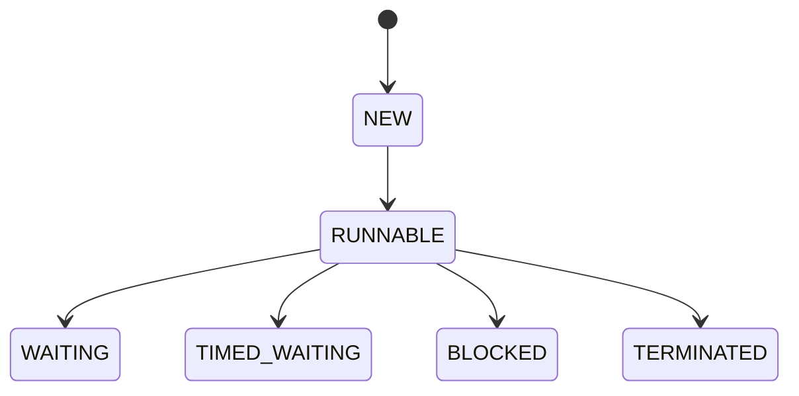

# **二、Java进阶篇详解**

## **1. 核心API与工具**

### **1.1 集合框架（Collection Framework）**

#### **1.1.1 List接口**
**概念**：有序集合，允许重复元素，可通过索引访问。

**实现类**：
- **ArrayList**：基于动态数组，查询快（O(1)），增删慢（O(n)）
- **LinkedList**：基于双向链表，增删快（O(1)），查询慢（O(n)）
- **Vector**：线程安全但性能较差（已过时）

**示例**：
```java
List<String> list = new ArrayList<>();
list.add("Java");
list.add("Python");
list.add(1, "C++"); // 在索引1处插入
System.out.println(list.get(0)); // 输出"Java"
```

**注意事项**：
- 遍历时避免使用`for(int i=0;...)`（LinkedList性能差），推荐`for-each`或`Iterator`
- 初始容量默认为10，扩容时增加50%（ArrayList）

---

#### **1.1.2 Set接口**
**概念**：无序集合，不允许重复元素。

**实现类**：
- **HashSet**：基于HashMap，O(1)时间复杂度
- **LinkedHashSet**：保持插入顺序
- **TreeSet**：基于红黑树，自动排序

**示例**：
```java
Set<Integer> set = new HashSet<>();
set.add(1);
set.add(2);
set.add(1); // 重复元素不会被添加
System.out.println(set.contains(2)); // true
```

**注意事项**：
- 自定义对象需重写`equals()`和`hashCode()`才能去重
- TreeSet要求元素实现`Comparable`或传入`Comparator`

---

#### **1.1.3 Map接口**
**概念**：键值对集合，键唯一。

**实现类**：
- **HashMap**：O(1)时间复杂度，允许null键/值
- **LinkedHashMap**：保持插入顺序
- **TreeMap**：按键排序
- **ConcurrentHashMap**：线程安全版本

**示例**：
```java
Map<String, Integer> map = new HashMap<>();
map.put("Alice", 90);
map.put("Bob", 85);
System.out.println(map.get("Alice")); // 90
```

**底层原理**：
- JDK8后：数组+链表+红黑树（链表长度>8时转红黑树）
- 负载因子默认0.75，扩容阈值=容量*负载因子

---

### **1.2 异常处理机制**

#### **1.2.1 异常分类**
| 类型          | 示例                  | 处理方式       |
|---------------|-----------------------|----------------|
| **Checked**   | `IOException`         | 必须捕获或声明 |
| **Unchecked** | `NullPointerException`| 可不处理       |
| **Error**     | `OutOfMemoryError`    | 不可恢复       |

#### **1.2.2 try-catch-finally**
```java
try {
    FileInputStream fis = new FileInputStream("test.txt");
} catch (FileNotFoundException e) {
    System.err.println("文件未找到: " + e.getMessage());
} finally {
    fis.close(); // 确保资源释放
}
```

**JDK7+改进**（try-with-resources）：
```java
try (FileInputStream fis = new FileInputStream("test.txt")) {
    // 自动关闭资源
}
```

#### **1.2.3 自定义异常**
```java
class MyException extends Exception {
    public MyException(String message) {
        super(message);
    }
}

// 使用
throw new MyException("自定义错误");
```

---

### **1.3 泛型与反射**

#### **1.3.1 泛型**
**类定义**：
```java
class Box<T> {
    private T data;
    public void setData(T data) { this.data = data; }
}
// 使用
Box<String> box = new Box<>();
box.setData("Hello");
```

**通配符**：
- `<?>`：未知类型
- `<? extends Number>`：上限通配符
- `<? super Integer>`：下限通配符

#### **1.3.2 反射**
```java
Class<?> clazz = Class.forName("java.lang.String");
Method method = clazz.getMethod("length");
String str = "test";
int len = (int) method.invoke(str); // 调用str.length()
```

**应用场景**：
- 框架设计（如Spring IOC）
- 动态代理

---

## **2. 文件与I/O操作**

### **2.1 字节流与字符流**

#### **2.1.1 字节流（InputStream/OutputStream）**
```java
try (FileInputStream fis = new FileInputStream("input.txt");
     FileOutputStream fos = new FileOutputStream("output.txt")) {
    byte[] buffer = new byte[1024];
    int len;
    while ((len = fis.read(buffer)) != -1) {
        fos.write(buffer, 0, len);
    }
}
```

#### **2.1.2 字符流（Reader/Writer）**
```java
try (BufferedReader br = new BufferedReader(new FileReader("input.txt"));
     BufferedWriter bw = new BufferedWriter(new FileWriter("output.txt"))) {
    String line;
    while ((line = br.readLine()) != null) {
        bw.write(line);
        bw.newLine();
    }
}
```

**对比**：
| 类型     | 单位 | 适用场景         |
|----------|------|------------------|
| 字节流   | 字节 | 图片、视频等二进制文件 |
| 字符流   | 字符 | 文本文件（自动处理编码） |

---

### **2.2 序列化与NIO**

#### **2.2.1 序列化**
```java
class Person implements Serializable {
    private static final long serialVersionUID = 1L;
    String name;
}

// 序列化
try (ObjectOutputStream oos = new ObjectOutputStream(new FileOutputStream("person.dat"))) {
    oos.writeObject(new Person("Alice"));
}

// 反序列化
try (ObjectInputStream ois = new ObjectInputStream(new FileInputStream("person.dat"))) {
    Person p = (Person) ois.readObject();
}
```

**注意事项**：
- `transient`修饰的字段不会被序列化
- 修改类定义后可能导致反序列化失败

#### **2.2.2 NIO（New I/O）**
```java
Path path = Paths.get("test.txt");
Files.write(path, "Hello NIO".getBytes(), StandardOpenOption.CREATE);

// 使用Channel快速复制文件
try (FileChannel src = FileChannel.open(Paths.get("src.txt"));
     FileChannel dest = FileChannel.open(Paths.get("dest.txt"), CREATE, WRITE)) {
    src.transferTo(0, src.size(), dest);
}
```

**核心组件**：
- **Channel**：双向数据传输
- **Buffer**：数据容器
- **Selector**：多路复用

---

## **3. 多线程与并发**

### **3.1 线程基础**

#### **3.1.1 创建线程**
```java
// 方式1：继承Thread
class MyThread extends Thread {
    @Override
    public void run() {
        System.out.println("Thread running");
    }
}

// 方式2：实现Runnable（推荐）
Runnable task = () -> System.out.println("Task running");
new Thread(task).start();
```

#### **3.1.2 线程状态**


---

### **3.2 线程同步**

#### **3.2.1 synchronized**
```java
class Counter {
    private int count = 0;
    
    public synchronized void increment() {
        count++;
    }
}
```

#### **3.2.2 Lock接口**
```java
Lock lock = new ReentrantLock();
try {
    lock.lock();
    // 临界区代码
} finally {
    lock.unlock(); // 必须手动释放
}
```

**对比**：
| 特性               | synchronized | Lock       |
|--------------------|--------------|------------|
| 获取超时           | 不支持        | `tryLock(timeout)` |
| 公平锁             | 非公平        | 可配置公平   |
| 条件变量           | `wait/notify`| `Condition`接口 |

---

### **3.3 线程池与并发工具**

#### **3.3.1 ThreadPoolExecutor**
```java
ExecutorService pool = Executors.newFixedThreadPool(4);
pool.submit(() -> System.out.println("Task executed"));
pool.shutdown();
```

**参数详解**：
- **corePoolSize**：核心线程数
- **workQueue**：任务队列（ArrayBlockingQueue）
- **RejectedExecutionHandler**：拒绝策略

#### **3.3.2 并发工具类**
```java
// CountDownLatch
CountDownLatch latch = new CountDownLatch(3);
latch.await(); // 等待计数器归零

// ConcurrentHashMap
Map<String, String> map = new ConcurrentHashMap<>();
map.putIfAbsent("key", "value");
```

**JUC包核心类**：
- `AtomicInteger`：原子操作
- `CopyOnWriteArrayList`：线程安全List
- `Semaphore`：信号量控制

---

## **总结对比表**
| 主题          | 关键实现类/接口          | 典型应用场景                 |
|---------------|-------------------------|-----------------------------|
| 集合框架      | HashMap/ArrayList       | 数据存储与快速访问           |
| 线程同步      | synchronized/ReentrantLock | 多线程共享资源控制         |
| NIO           | Channel/Buffer          | 高性能网络通信               |

建议结合实际项目练习：
1. 使用HashMap实现缓存系统
2. 用线程池处理批量文件上传
3. 通过NIO实现简易HTTP服务器