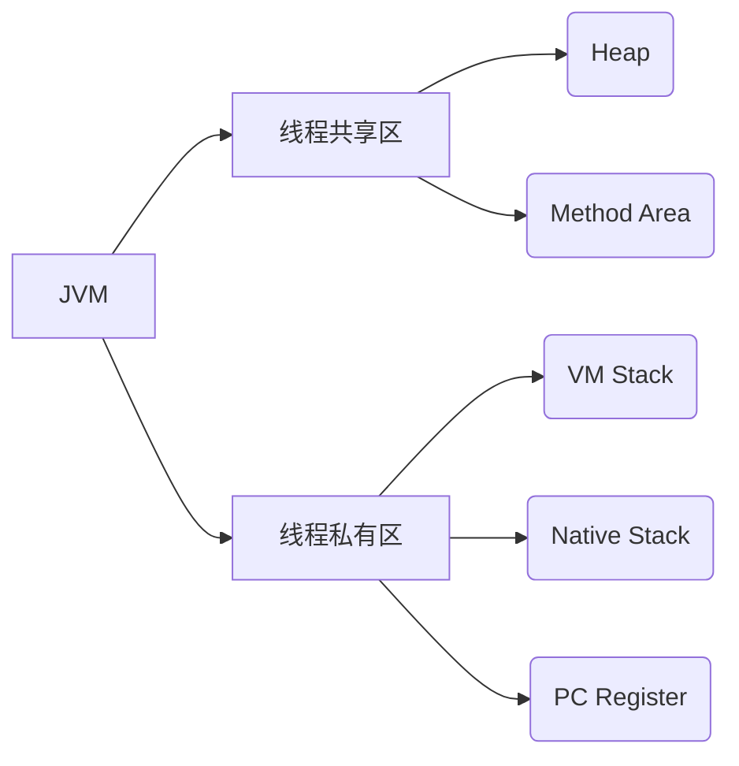

# **三、Java高级篇详解**

## **1. 数据库编程**

### **1.1 JDBC核心编程**

#### **1.1.1 完整连接流程**
```java
// 1. 加载驱动（JDBC 4.0+自动加载，可省略）
Class.forName("com.mysql.cj.jdbc.Driver");

// 2. 获取连接（重要参数说明）
String url = "jdbc:mysql://localhost:3306/mydb?"
           + "useSSL=false&serverTimezone=Asia/Shanghai&useUnicode=true&characterEncoding=UTF-8";
Connection conn = DriverManager.getConnection(url, "user", "password");

// 3. 创建Statement（PreparedStatement更安全）
String sql = "SELECT * FROM users WHERE age > ?";
PreparedStatement ps = conn.prepareStatement(sql);
ps.setInt(1, 18);  // 参数索引从1开始

// 4. 执行查询
ResultSet rs = ps.executeQuery();
while (rs.next()) {
    System.out.println(rs.getString("name") + ": " + rs.getInt("age"));
}

// 5. 关闭资源（必须逆序关闭）
rs.close();
ps.close();
conn.close();  // 实际项目建议用连接池
```

**关键点解析**：
- **连接参数**：
  - `useSSL=false`：禁用SSL（测试环境）
  - `serverTimezone`：必须设置时区（中国用`Asia/Shanghai`）
  - `rewriteBatchedStatements=true`：启用批量操作优化
- **事务控制**：
  ```java
  conn.setAutoCommit(false);  // 开启事务
  try {
      // 执行多个SQL
      conn.commit();  // 提交
  } catch (SQLException e) {
      conn.rollback();  // 回滚
  }
  ```

#### **1.1.2 连接池最佳实践**
**HikariCP配置示例**：
```java
HikariConfig config = new HikariConfig();
config.setJdbcUrl("jdbc:mysql://localhost/mydb");
config.setUsername("user");
config.setPassword("password");
config.setMaximumPoolSize(20);  // 最大连接数
config.setConnectionTimeout(30000);  // 连接超时(ms)
config.setIdleTimeout(600000);  // 空闲连接存活时间

HikariDataSource ds = new HikariDataSource(config);
Connection conn = ds.getConnection();  // 从池中获取
```

**连接池参数调优**：
| 参数 | 推荐值 | 说明 |
|------|--------|------|
| `maximumPoolSize` | CPU核数*2 + 磁盘数 | 过高会导致竞争 |
| `minimumIdle` | 同`maximumPoolSize` | 保持连接预热 |
| `leakDetectionThreshold` | 60000 | 连接泄漏检测(ms) |

---

### **1.2 ORM框架深度对比**

#### **1.2.1 MyBatis核心用法**
**Mapper接口定义**：
```java
public interface UserMapper {
    @Select("SELECT * FROM users WHERE id = #{id}")
    User getUserById(@Param("id") int id);

    @Insert("INSERT INTO users(name,age) VALUES(#{name},#{age})")
    @Options(useGeneratedKeys=true, keyProperty="id")
    void insertUser(User user);
}
```

**XML映射文件**：
```xml
<!-- UserMapper.xml -->
<select id="selectUsers" resultType="User">
  SELECT * FROM users WHERE age > #{minAge}
  ORDER BY ${orderBy}  <!-- #{}防SQL注入，${}直接拼接 -->
</select>
```

**动态SQL示例**：
```xml
<update id="updateUser">
  UPDATE users
  <set>
    <if test="name != null">name=#{name},</if>
    <if test="age != null">age=#{age}</if>
  </set>
  WHERE id=#{id}
</update>
```

#### **1.2.2 Hibernate JPA实践**
**实体类映射**：
```java
@Entity
@Table(name = "users")
public class User {
    @Id
    @GeneratedValue(strategy = GenerationType.IDENTITY)
    private Long id;
    
    @Column(nullable = false, length = 50)
    private String name;
    
    @Enumerated(EnumType.STRING)
    private Gender gender;  // 枚举映射
    
    @OneToMany(mappedBy = "user", cascade = CascadeType.ALL)
    private List<Order> orders;
}
```

**JPA查询方式**：
```java
// 方法名查询
public interface UserRepository extends JpaRepository<User, Long> {
    List<User> findByNameContainingAndAgeGreaterThan(String name, int age);
}

// JPQL手动编写
@Query("SELECT u FROM User u WHERE u.age > :age ORDER BY u.name")
List<User> findAdultUsers(@Param("age") int age);
```

**性能优化技巧**：
- 启用二级缓存：`@Cacheable`
- 批量操作：`hibernate.jdbc.batch_size=50`
- N+1问题解决：`@EntityGraph`或`JOIN FETCH`

---

## **2. 网络编程**

### **2.1 Socket底层通信**

#### **2.1.1 TCP服务端/客户端**
**服务端代码**：
```java
try (ServerSocket server = new ServerSocket(8080)) {
    while (true) {
        Socket client = server.accept();  // 阻塞等待连接
        new Thread(() -> {
            try (InputStream in = client.getInputStream();
                 OutputStream out = client.getOutputStream()) {
                byte[] buffer = new byte[1024];
                int len = in.read(buffer);
                String request = new String(buffer, 0, len);
                out.write(("Response: " + request).getBytes());
            }
        }).start();
    }
}
```

**客户端代码**：
```java
try (Socket socket = new Socket("localhost", 8080);
     OutputStream out = socket.getOutputStream();
     InputStream in = socket.getInputStream()) {
    out.write("Hello Server".getBytes());
    byte[] response = new byte[1024];
    in.read(response);
    System.out.println(new String(response));
}
```

**关键问题**：
- **粘包处理**：定义消息头（长度）+消息体
- **线程模型**：BIO vs NIO（Selector多路复用）

#### **2.1.2 UDP通信示例**
```java
// 发送端
DatagramSocket socket = new DatagramSocket();
byte[] data = "UDP message".getBytes();
DatagramPacket packet = new DatagramPacket(
    data, data.length, InetAddress.getByName("localhost"), 9090);
socket.send(packet);

// 接收端
byte[] buffer = new byte[1024];
DatagramPacket packet = new DatagramPacket(buffer, buffer.length);
socket.receive(packet);  // 阻塞接收
System.out.println(new String(packet.getData()));
```

---

### **2.2 HTTP高级应用**

#### **2.2.1 HttpClient使用**
```java
CloseableHttpClient client = HttpClients.custom()
    .setConnectionManager(new PoolingHttpClientConnectionManager())
    .build();

HttpGet request = new HttpGet("http://example.com/api");
try (CloseableHttpResponse response = client.execute(request)) {
    String json = EntityUtils.toString(response.getEntity());
    System.out.println(json);
}
```

**连接池配置**：
```java
PoolingHttpClientConnectionManager cm = new PoolingHttpClientConnectionManager();
cm.setMaxTotal(200);  // 最大连接数
cm.setDefaultMaxPerRoute(20);  // 每个路由最大连接
```

#### **2.2.2 WebSocket通信**
```java
@ServerEndpoint("/chat")
public class ChatEndpoint {
    @OnOpen
    public void onOpen(Session session) {
        session.getAsyncRemote().sendText("Welcome!");
    }

    @OnMessage
    public void onMessage(String message, Session session) {
        session.getAsyncRemote().sendText("Echo: " + message);
    }
}
```

---

## **3. JVM深度解析**

### **3.1 内存模型详解**

#### **3.1.1 运行时数据区**


**关键参数**：
- `-Xms`：初始堆大小（默认物理内存1/64）
- `-Xmx`：最大堆大小（默认物理内存1/4）
- `-XX:MetaspaceSize`：元空间初始大小（JDK8+）

#### **3.1.2 垃圾回收算法**
| 算法 | 实现 | 适用场景 |
|------|------|----------|
| 标记-清除 | CMS | 老年代（内存碎片问题） |
| 复制 | Parallel Scavenge | 新生代（Survivor区） |
| 标记-整理 | G1 | 全堆（内存规整） |

**GC日志分析**：
```
[GC (Allocation Failure) [PSYoungGen: 65536K->10720K(76288K)] 
  65536K->10800K(251392K), 0.0113388 secs]
```
- `PSYoungGen`：Parallel Scavenge收集器
- `65536K->10720K`：回收前->回收后大小
- `0.0113388 secs`：耗时

### **3.2 性能调优实战**

#### **3.2.1 内存泄漏排查**
1. **生成堆转储**：
   ```bash
   jmap -dump:format=b,file=heap.hprof <pid>
   ```
2. **MAT分析**：
   - 查找`Retained Heap`最大的对象
   - 检查`GC Roots`引用链

#### **3.2.2 JVM参数模板**
```bash
java -Xms4g -Xmx4g 
     -XX:+UseG1GC 
     -XX:MaxGCPauseMillis=200 
     -XX:ParallelGCThreads=4 
     -XX:ConcGCThreads=2 
     -Xloggc:/path/to/gc.log 
     -jar app.jar
```

**线上问题诊断流程**：
1. `top`查看CPU/内存占用
2. `jstack <pid>`分析线程栈
3. `jstat -gcutil <pid> 1000`观察GC频率
4. `arthas`在线诊断（OGNL表达式查询）

---

## **总结对比表**
| 技术领域 | 核心组件 | 生产级实践 |
|---------|----------|------------|
| JDBC | `PreparedStatement`/`HikariCP` | 批处理+连接池监控 |
| ORM | `MyBatis`/`Hibernate` | 二级缓存+SQL优化 |
| JVM | `G1`/`ZGC` | GC日志+堆分析 |

**推荐工具链**：
- 数据库：Druid监控 + MyBatis-Plus
- 网络：Wireshark抓包 + Postman测试
- JVM：Arthas + VisualVM